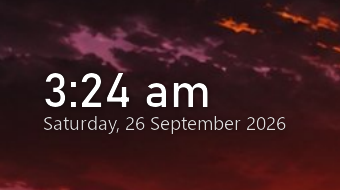
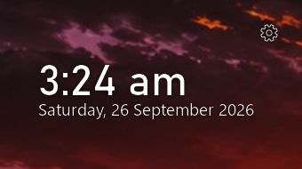

# Minimal transparent clock

Two lines of text on your wallpaper — the time and the date. No window, no card, no panel, and
no transparent box either: the pixels the widget does not paint *are* your wallpaper, so
anything moving behind it keeps moving.



24-hour or 12-hour. White ink or near-black, whichever suits what is behind it. Dragged by its
text, resized from its bottom-right corner, and it stays on the desktop when you press Win+D.

## Install

```
git clone https://github.com/Hamras47/Minimal-transparent-clock-widget
cd Minimal-transparent-clock-widget
python -m venv .venv
.venv\Scripts\python.exe -m pip install -r requirements.txt
```

Then double-click **`run.cmd`**, or run `pythonw app.py`. Windows, Python 3.14.

## Controls

| | |
|---|---|
| **Move** | Drag the text. Windows' own window drag does it. |
| **Resize** | Drag the bottom-right corner. The text scales with the width. |
| **Menu** | Hover the text and click the gear that appears, or right-click the text. |
| **Tray** | The same menu, plus Show, when the widget is hidden. |



The menu holds five switches — 24-hour clock, Always on top, Stay on the desktop, Draggable,
Start with Windows — then **Fit to text**, **Open folder** and **Quit**. They are stored in
`config.json` next to the widget, along with its position and size.

**Stay on the desktop** is the point of the widget: showing the desktop (Win+D, or the button at
the end of the taskbar) leaves the text sitting on the wallpaper instead of minimizing it, and
pressing Win+D again puts it back behind your windows rather than on top of them.

## The files

| | |
|---|---|
| `app.py` | the host: the window, the gestures, the menu, the tray, the preferences |
| `surface.py` | the face: the two lines, the halo, the ink, and what is clickable |
| `clock.py` | the clock itself, with no Windows in it |
| `tests/test_clock.py` | 23 tests for `clock.py` |

```
python app.py --self-check       what it would draw, and how much of the window is opaque
python app.py --render tmp/x.png the face as a PNG over a chequerboard
python app.py --debug            echo the log, which otherwise goes to widget.log
```

How the transparency is done — and the two approaches that look right and do not work — is in
[doc/how-it-works.md](doc/how-it-works.md).
